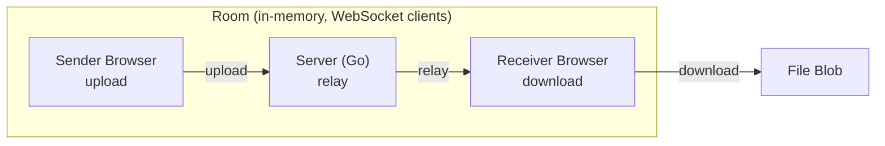

## holo

Minimalist peer‑to‑peer–style file sharing web app.

- **Backend**: Go WebSocket relay server (memory‑only, no persistence)
- **Frontend**: Next.js + TypeScript, HTML5 File APIs, clean light UI



### Structure

- `backend/` – Go WebSocket relay
- `frontend/` – Next.js app

### Getting started

#### Backend

```bash
cd backend
go mod tidy
go run ./cmd/holo-server
```

The server listens on `http://localhost:8080` and exposes a WebSocket endpoint at `/ws`.

#### Frontend

```bash
cd frontend
npm install
npm run dev
```

The app runs on `http://localhost:3000` by default.

Set `NEXT_PUBLIC_WS_URL` to point at your Go server if you change its address, e.g.:

```bash
NEXT_PUBLIC_WS_URL=ws://localhost:8080/ws npm run dev
```

### Notes

- No database, no disk storage – file bytes are only relayed in memory.
- Rooms and connections are ephemeral and auto‑expire after inactivity.
- Large files are streamed in chunks over WebSockets to avoid RAM spikes.

