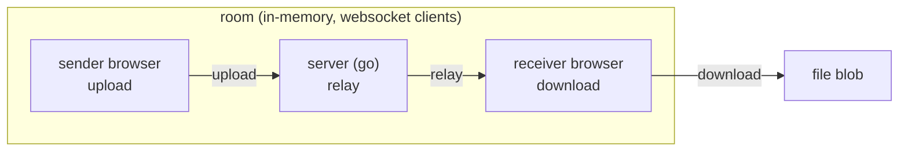

<p align="center">
  
</p>

<p align="center">
  <a href="https://github.com/ufraaan/holo/actions"></a>
  <a href="https://github.com/ufraaan/holo/actions"></a>
  <a href="https://github.com/ufraaan/holo/actions"></a>
  <a href="https://github.com/ufraaan/holo/actions"></a>
  <a href="LICENSE"></a>
  <a href="https://github.com/ufraaan/holo/issues"></a>
</p>

<br>

share files and text between devices instantly. no accounts, no storage, just a room.

create a room, share the 6-character code, and anything you drop in is relayed directly to the other side. no uploads to disk, no database, no sign-up.

## how it works

a lightweight go server acts as a websocket relay. it never inspects, stores, or processes the data it forwards. it simply groups connections by room ID and broadcasts messages from one client to the others.

```
sender browser → websocket → go relay server → websocket → receiver browser
```



when you drop a file, the browser reads it in 64 KB slices, base64-encodes each slice, wraps it in a JSON message with metadata (file ID, offset, final flag), and sends it over the websocket. the server receives the complete frame and forwards the raw bytes to every other client in the room (sender excluded). the receiving browser decodes each chunk and accumulates them until the final chunk arrives, at which point it assembles them into a downloadable Blob.

text shares work the same way, but as single messages rather than chunked sequences.

### message protocol

all communication uses JSON messages over the websocket:

| type | purpose | payload |
|---|---|---|
| `file-meta` | announces a new file transfer | `fileId`, `name`, `size`, `mime` |
| `file-chunk` | carries one 64 KB chunk | `fileId`, `chunk` (base64), `offset`, `final` |
| `text` | sends a text share | `text`, `customName?` |

## structure

```
holo/
├── backend/
│   ├── cmd/holo-server/       # starts the server
│   └── internal/server/       # relay logic, rooms, and connections
│       ├── client.go          # reads from and writes to each websocket
│       ├── room.go            # keeps track of who's in a room and relays messages
│       └── hub.go             # manages all rooms and cleans up old ones
└── frontend/
    ├── app/
    │   ├── (main)/page.tsx    # home page with the video background
    │   └── room/[roomId]/     # the room where you drop files and send text
    └── components/
        ├── BackgroundVideo.tsx        # fullscreen video that plays behind everything
        ├── room/
        │   ├── useRoomWebSocket.ts    # handles the websocket connection
        │   ├── room-utils.ts          # splits files into chunks, formats sizes
        │   ├── RoomHeader.tsx         # shows the room code and connection status
        │   ├── FileDropZone.tsx       # drag-and-drop area for files
        │   ├── TextInputArea.tsx      # where you type text to share
        │   └── TransferList.tsx       # list of incoming and outgoing transfers
```

| | backend (go) | frontend (Next.js + TypeScript) |
|---|---|---|
| **what it does** | stateless websocket relay. never inspects or stores data | browser app that chunks files, sends/receives, and renders the UI |
| **how it works** | each connection runs two goroutines: **readPump** reads messages and pushes them to the room, **writePump** pulls from a buffered channel and writes to the socket | two pages: **landing page** (`/`) with video background and create/join UI, **room page** (`/room/[roomId]`) with file drop, text input, and transfer list |
| **connections** | gorilla/websocket with 64 KB buffers, 2 MB max frame size, ping/pong keepalive | browser websocket API with reconnection support and retry button |
| **file flow** | receives the full frame and forwards raw bytes to every other client in the room | splits files into **64 KB chunks** using `File.slice()`, base64-encodes each, and sends as JSON messages (`file-meta` + `file-chunk`); receiver accumulates chunks into a `Blob` for download |
| **memory** | holds one chunk per connection at a time; slow consumers get disconnected | sender processes one chunk at a time; receiver holds all chunks until the final one arrives, then assembles |
| **lifecycle** | rooms auto-expire after **10 minutes** of inactivity, garbage collector runs every minute | ephemeral. refresh the page and you start fresh |

## running locally

### backend

```bash
cd backend
go mod tidy
go run ./cmd/holo-server
```

the server listens on `http://localhost:8080`. websocket endpoint: `/ws`.

> requires [Go](https://go.dev/dl/) to build and run.

### frontend

```bash
cd frontend
npm install
npm run dev
```

the app runs on `http://localhost:3000` by default.

> requires [Node.js](https://nodejs.org/) to build and run.

to point the frontend at a different server address:

```bash
NEXT_PUBLIC_WS_URL=ws://localhost:8080/ws npm run dev
```

---

<p align="center">
  <a href="https://holo.ufraan.dev/">try it live</a>
  ·
  <a href="https://github.com/ufraaan/holo/issues/new?labels=bug&template=bug-report.md">report a bug</a>
  ·
  <a href="https://github.com/ufraaan/holo/issues/new?labels=enhancement&template=feature-request.md">feature request</a>
</p>
